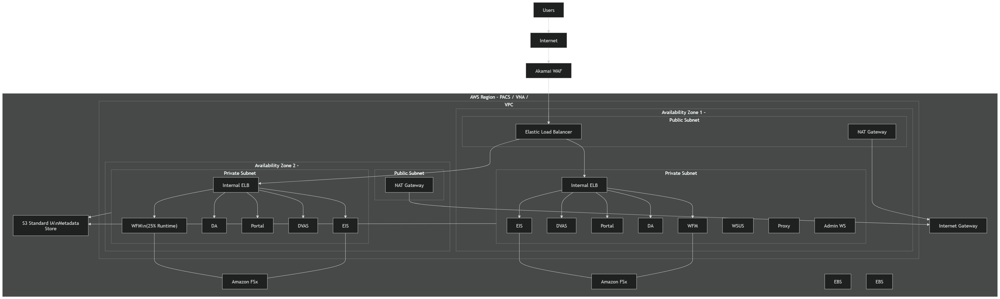

# aws-dual-az-ha-architecture
Single-region, dual-AZ highly available AWS architecture with private application tiers and active/standby design.

# AWS Dual-AZ Highly Available Architecture

## Overview
This project demonstrates a single-region, dual-availability-zone AWS architecture designed
for 99.99% uptime. It models a healthcare-style workload (PACS / VNA / Enterprise Viewer)
with strict network isolation, private application tiers, and fault tolerance.

## Architecture Highlights
- Single AWS Region, Dual AZ
- Public ingress protected by WAF
- Private application services only
- Active / Standby AZ design
- Independent NAT per AZ
- Metadata synchronization via S3
- Designed for fast AZ-level failover

## Key Design Goals
- **High Availability**: Active/Standby across 2 AZs with continuous metadata sync
- **Security**: Akamai WAF → Internet Gateway → private subnets only
- **HIPAA-aligned**: No PHI traverses public subnets; EBS encryption at rest
- **Cost-optimized**: S3 Standard-IA for cold archive; 25% runtime standby EC2s

## Architecture Diagram

## Build Steps
- Step 1: VPC & Networking (Dual AZ)
- Step 2: Security Baseline & IAM
- Step 3: Ingress (ALB + WAF)
- Step 4: Internal Load Balancing
- Step 5: Compute & Auto Scaling
- Step 6: Storage & Replication
- Step 7: Monitoring & Failover Testing

## Build Progress

| Phase | Component | Status |
|---|---|---|
| 1 | VPC (pacs-ha-vpc, 10.0.0.0/16) | ✅ Complete |
| 2 | Subnets — 4 across 2 AZs | ✅ Complete |
| 3 | Internet Gateway | ✅ Complete |
| 4 | Route Tables (public/private) | ✅ Complete |
| 5 | Security Groups | 🔄 In Progress |
| 6 | EC2 Instances (PACS nodes) | ⏳ Pending |
| 7 | Application Load Balancer | ⏳ Pending |
| 8 | Route 53 Failover | ⏳ Pending |
| 9 | S3 Archive + Lifecycle Policy | ⏳ Pending |
| 10 | Managed AD + WSUS | ⏳ Pending |

## Why This Project
The goal is to demonstrate **cloud architecture decision-making**, not just deployment.
Trade-offs around availability, cost, blast radius, and operational complexity are documented.

## Status
🚧 In Progress
